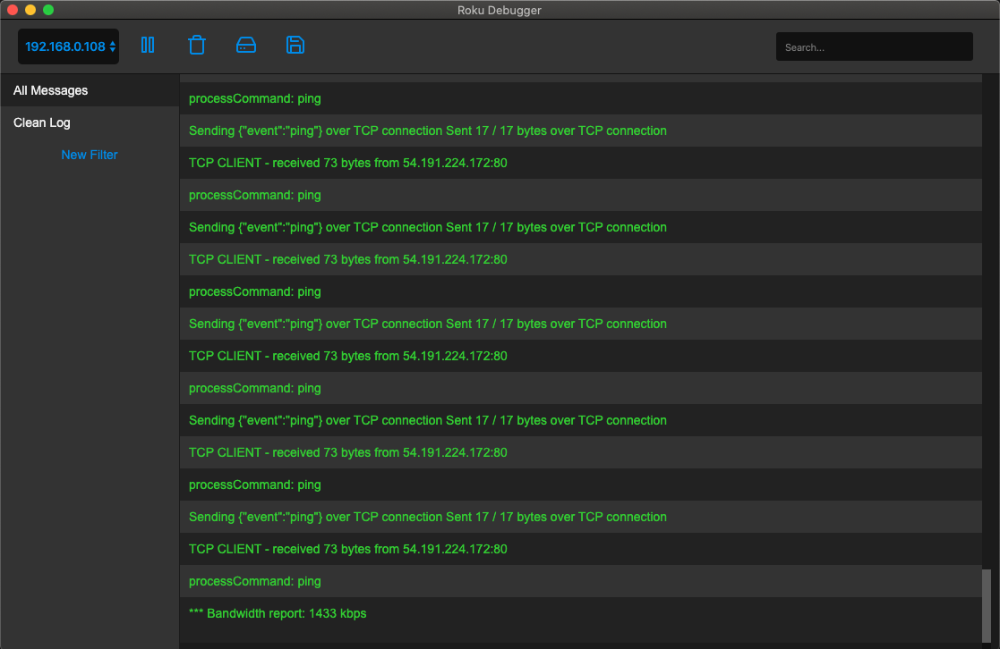

# Roku Debugger
Roku Debugger is a tool that helps debug Roku telnet logs that support automatic device detection, custom filters, color coded logs and more.



<br>

## Install

First, clone the repo via git and install dependencies:

```bash
git clone https://github.com/armadilio3/RokuDebugger
cd RokuDebugger
yarn
```

## Run

Run the app in development
```bash
yarn dev
```

## How to use Roku Debugger

When launching the app it will automatically look for devices on your local network and connect to the first one it finds.

The main reason why this tool was developed are the filters. You can create your custom filters that will remove any unneeded logs. To create a new filter click the New Filter button in the sidebar and once you’re done editing the json, click save to add it to your list of filters.

This a minimal sample filter:

```
{
 "name": "Filter name that will appear in the sidebar",
 "remove": {
  "contains": [
   "something you want excluded from the list of logs that includes this string"
  ],
  "exact": [
   "something you want excluded fro mthe list of logs that is an exact match",
  ]
 }
}
```

If you want to edit or delete an existing filter just double click on the filter name in the sidebar. Another quick way to filter out logs without creating a filter is just using the search bar found in the top right corner. Note it will search the filtered logs so if you want it to search from all logs then select All Messages in the sidebar.

In addition to search and filter you can pause, resume and clear all logs. And the final two buttons allow you to read local telnet log files (filters will work on local files as well) and save the logs you have received during the session (this will save the raw logs as they were sent without any filters or modifications).


## Packaging for Production

To package apps for the local platform:

```bash
yarn package
```

## Acknowledgments
This project is based on the awesome React Electron Boilerplate project https://github.com/electron-react-boilerplate/electron-react-boilerplate

## License

MIT © [Roku Debugger](https://github.com/armadilio3/RokuDebugger/blob/master/LICENSE)